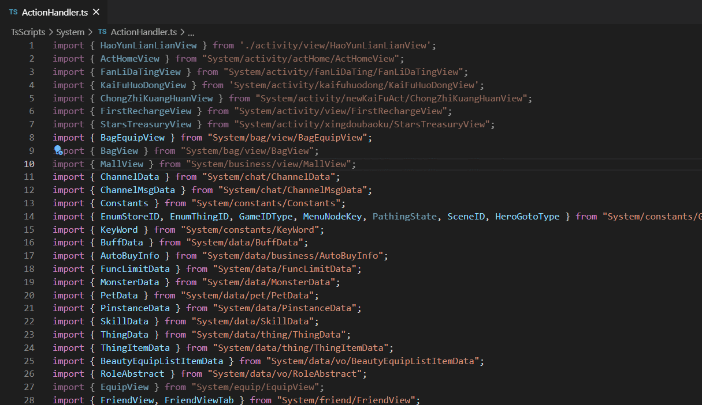

# trim-ts-import for Visual Studio Code

-----------------------------------------------------------------------------------------------------------

The trim-ts-imports extension removes unused import statements for Typescript. Different with the `ctrl+alt+o` function, trim-ts-imports won't re-orgnise the import lines.

## Features

Right click menu **Trim Ts Imports** or press `Ctrl+shift+i`

## Known Issues

Sometimes this extension may not work fine when the Typescript code contains some error.

## Release Notes

### 0.0.1

Initial release of trim-ts-imports.

### 0.0.2

Fix bugs.

-----------------------------------------------------------------------------------------------------------

### For more information

* [trim-ts-imports](https://github.com/Halliwood/trim-ts-imports)
* [vsce-trim-ts-imports](https://github.com/Halliwood/vsce-trim-ts-imports)
